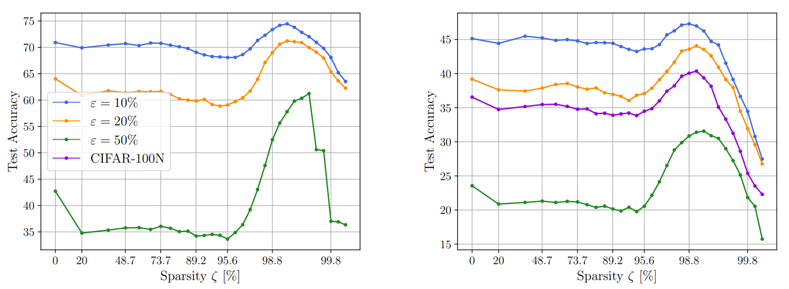

# Sparse Double Descent in Vision Transformers: real or phantom threat?

[](https://arxiv.org/pdf/2307.14253.pdf)

This GitHub implements the key experiments of the following paper : [Sparse Double Descent in Vision Transformers: real or phantom threat?](https://arxiv.org/pdf/2307.14253.pdf).

## Occurrence of Sparse Double Descent in Vision Transformers?



Figure: Test accuracy of ViT on **(Left.)** CIFAR-10 and **(Right.)** CIFAR-100 with different amount of label noise $\varepsilon$.

## Libraries
* Python = 3.10
* PyTorch = 1.13
* Torchvision = 0.14
* Numpy = 1.23

## Usage

In practice, you can begin with a set of defaults and optionally modify individual hyperparameters as desired. To view the hyperparameters for each subcommand, use the following command. 
```
main.py [subcommand] [...] --help
```

## Example Runs

To run a ViT on CIFAR-10 with 10% of label noise, batch size of 512, learning rate of 1e-4, weight decay of 0.03 for 200 epochs:
```python main.py```

To run a ResNet-18 on CIFAR-100 with 20% of label noise, batch size of 128, learning rate of 0.1, and weight decay of 1e-4 for 160 epochs:
```python main.py --model='resnet-18' --num_classes=100 --amount_noise=0.2 --batch_size=128 --learning_rate=0.1 --weight_decay=1e-4 --epochs=160```

## Citation
If you find this useful for your research, please cite the following paper.
```
@misc{quétu2023sparse,
      title={Sparse Double Descent in Vision Transformers: real or phantom threat?}, 
      author={Victor Quétu and Marta Milovanovic and Enzo Tartaglione},
      year={2023},
      eprint={2307.14253},
      archivePrefix={arXiv},
      primaryClass={cs.CV}
}
```
